[](https://github.com/garganttua/garganttua-api/actions/workflows/maven-publish.yml)

# Garganttua API

**Garganttua API** generates declarative, annotation-driven REST APIs from your domain entities. Mark a class with `@Entity` and a few role/characteristic annotations, point it at a DTO and a DAO, and the framework wires up CRUD operations, multi-tenant isolation, ownership rules, pluggable security (JWT, bcrypt, PIN), and a request/response pipeline — with AOT/GraalVM-native readiness baked in. It is built on [garganttua-core](https://github.com/garganttua/garganttua-core).

## ⚠️ Disclaimer

This project is in **alpha** and under active development on the `DEV-3.0.0` branch (version `3.0.0-ALPHA01`). APIs, module layout, and DSL surface may change without notice.

This documentation is partially generated and may not always reflect the exact implementation. If you find anything incorrect or unclear, please reach out at [jeremy.colombet@garganttua.com](mailto:jeremy.colombet@garganttua.com).

## 🎯 Key Features

- **Declarative, annotation-driven REST** — Describe entities with `@Entity*` annotations (or the fluent DSL) and get CRUD endpoints generated for you.
- **Multi-tenancy with roles & characteristics** — Tenant / Owner / Owned roles and Public / Geolocalized / Hiddenable / Shared characteristics combine into a repository access-filter matrix.
- **Pluggable security** — Authentication strategies (login-password, PIN, challenge), JWT authorizations, bcrypt hashing, and per-domain authenticator/authorization/key configuration.
- **Fluent DSL builders** — Hierarchical `ApiBuilder` fluent API for context construction, with `up()` navigation back to parent builders.
- **Pipeline & workflow engine** — Request execution flows through an 8-stage pipeline compiled to garganttua-core Workflows (`.gs` scripts), with per-stage timing.
- **AOT / native readiness** — `@Reflected` coverage and AOT reflection seeds across active modules for GraalVM native-image compilation.
- **MongoDB DAO** — Out-of-the-box MongoDB data-access implementation alongside the in-memory DAO.
- **Opinionated starters** — One-coordinate starters bundling DAO + transport + reflection mode for quickstart, JVM/Mongo/Javalin, and AOT/Mongo/Javalin setups.

## 💡 Philosophy

Describe *what* your domain is, not *how* to serve it. Roles and characteristics declared once on an entity drive tenancy, ownership, visibility, and security uniformly across every operation — so the boilerplate of a multi-tenant secured REST API disappears into a declarative configuration, and the runtime path stays fast and native-friendly.

## Installation
<!-- AUTO-GENERATED-START -->
### Installation with Maven
```xml
<dependency>
    <groupId>com.garganttua</groupId>
    <artifactId>garganttua-api</artifactId>
    <version>3.0.0-ALPHA04</version>
</dependency>
```

### Actual version
3.0.0-ALPHA04

### Dependencies

<!-- AUTO-GENERATED-END -->

## 🧠 Architecture Overview

Garganttua API is organized into independent modules, each focusing on a specific concern of API generation, data access, transport, and security:

<!-- AUTO-GENERATED-ARCHITECTURE-START -->
| Module | Description |
|:--|:--|
| [**api**](././README.md) | Declarative, annotation-driven REST API framework — multi-tenancy, pluggable security, AOT/native-ready — built on garganttua-core. |
| \|- [**garganttua-api-bindings**](./garganttua-api-bindings/README.md) | Aggregator for third-party bindings — each submodule wraps one external library (Jackson, SLF4J, JsonPath, MongoDB driver, Javalin) so consumers depend on a binding artifact, keeping library swaps a pom-level edit. |
| \|    \|- [**garganttua-api-binding-jackson**](./garganttua-api-bindings/garganttua-api-binding-jackson/README.md) | Binding wrapping Jackson (annotations, core, databind, dataformat-xml + geojson-jackson) — pins the JSON/XML (de)serialization library used across the API and ships the framework's JSON and XML ISerializer implementations. |
| \|    \|- [**garganttua-api-binding-javalin**](./garganttua-api-bindings/garganttua-api-binding-javalin/README.md) | Binding wrapping Javalin (lightweight HTTP server). Ships a Javalin-backed IInterface (transport entry point) plus its companion IProtocol Context adapter. |
| \|    \|- [**garganttua-api-binding-jsonpath**](./garganttua-api-bindings/garganttua-api-binding-jsonpath/README.md) | Binding wrapping Jayway JsonPath — isolates the json-path dependency (used by the JWT security module for claims extraction). |
| \|    \|- [**garganttua-api-binding-mongodb**](./garganttua-api-bindings/garganttua-api-binding-mongodb/README.md) | Binding wrapping the MongoDB sync driver — consumed by garganttua-api-dao-mongodb. |
| \|    \|- [**garganttua-api-binding-slf4j**](./garganttua-api-bindings/garganttua-api-binding-slf4j/README.md) | Binding wrapping SLF4J (façade + simple impl) — opt-in classic SLF4J logging for downstream apps and bridging into the framework's observability logger. |
| \|- [**garganttua-api-commons**](./garganttua-api-commons/README.md) | Pure contract layer: interfaces, annotations, enums and definition records shared by every API module. Zero business logic. |
| \|- [**garganttua-api-core**](./garganttua-api-core/README.md) | Core engine: DSL builders, definition/context model, request pipeline and workflow assembly, repository filters and security expressions. |
| \|- [**garganttua-api-dao**](./garganttua-api-dao/README.md) | Data-access abstractions for entity persistence (parent module). |
| \|    \|- [**garganttua-api-dao-mongodb**](./garganttua-api-dao/garganttua-api-dao-mongodb/README.md) | MongoDB DAO implementation — native-ready repository backed by the MongoDB driver. |
| \|- [**garganttua-api-interface**](./garganttua-api-interface/README.md) | Interface-layer abstractions for exposing domains over transport protocols (parent module). |
| \|    \|- [**garganttua-api-interface-rest**](./garganttua-api-interface/garganttua-api-interface-rest/README.md) | REST interface binding — maps domain CRUD operations to HTTP/REST endpoints. |
| \|- [**garganttua-api-javalin**](./garganttua-api-javalin/README.md) | Javalin HTTP integration — serves API domains over a lightweight Javalin web layer. |
| \|- [**garganttua-api-native-image**](./garganttua-api-native-image/README.md) | GraalVM native-image support (parent module). |
| \|    \|- [**garganttua-api-native-image-config**](./garganttua-api-native-image/garganttua-api-native-image-config/README.md) | Generates native-image reflection/resource configuration for API modules. |
| \|- [**garganttua-api-security**](./garganttua-api-security/README.md) | Security implementations: authentication strategies and authorization protocols (parent module). |
| \|    \|- [**garganttua-api-security-authentication-authorization**](./garganttua-api-security/garganttua-api-security-authentication-authorization/README.md) | Authorization-token authentication: authenticate a caller from an existing authorization (refresh flow). |
| \|    \|- [**garganttua-api-security-authentication-challenge**](./garganttua-api-security/garganttua-api-security-authentication-challenge/README.md) | Challenge-response authentication strategy. |
| \|    \|- [**garganttua-api-security-authentication-login-password**](./garganttua-api-security/garganttua-api-security-authentication-login-password/README.md) | Login + password (bcrypt) authentication strategy with account-status checks. |
| \|    \|- [**garganttua-api-security-authentication-pin**](./garganttua-api-security/garganttua-api-security-authentication-pin/README.md) | PIN-code authentication strategy with error-counter lockout. |
| \|    \|- [**garganttua-api-security-authorization-jwt**](./garganttua-api-security/garganttua-api-security-authorization-jwt/README.md) | JWT authorization: signable/refreshable JWT tokens (pending migration to the 3.0.0 core). |
| \|- [**garganttua-api-starters**](./garganttua-api-starters/README.md) | Opinionated Spring Boot / Javalin starters bundling a ready-to-run API stack (parent module). |
| \|    \|- [**garganttua-api-starter-aot-mongo-javalin**](./garganttua-api-starters/garganttua-api-starter-aot-mongo-javalin/README.md) | AOT/native starter: same stack as jvm-mongo-javalin but with AOT reflection 		providers ahead of the runtime ones (GraalVM-ready). |
| \|    \|- [**garganttua-api-starter-bootstrap**](./garganttua-api-starters/garganttua-api-starter-bootstrap/README.md) | Bootstrap starter: a Spring-Boot-style runner (GarganttuaApplication.run) that 		assembles the framework, scans @Entity/@Dto, runs ServiceLoader auto-configs and reads 		application.yaml — transport- and persistence-agnostic (no Mongo, no Javalin). |
| \|    \|- [**garganttua-api-starter-javalin**](./garganttua-api-starters/garganttua-api-starter-javalin/README.md) | Javalin add-on starter: exposes every annotation-scanned domain over HTTP on a 		shared Javalin server (server.port), with JSON serialization out of the box. |
| \|    \|- [**garganttua-api-starter-jvm-mongo-javalin**](./garganttua-api-starters/garganttua-api-starter-jvm-mongo-javalin/README.md) | JVM starter: bootstrap runner + MongoDB persistence + Javalin HTTP, runtime reflection. |
| \|    \|- [**garganttua-api-starter-mongodb**](./garganttua-api-starters/garganttua-api-starter-mongodb/README.md) | MongoDB add-on starter: auto-wires a default MongoDB DAO from application.yaml 		(mongodb.uri / mongodb.database) onto every annotation-scanned domain. |
| \|    \|- [**garganttua-api-starter-quickstart**](./garganttua-api-starters/garganttua-api-starter-quickstart/README.md) | Quickstart starter: the bootstrap runner with the runtime reflection stack — 		no persistence, no transport. Supply your own in-memory IDao for tutorials and tests. |


<!-- AUTO-GENERATED-ARCHITECTURE-STOP -->

## 📚 Module Categories

### Foundation

- **[garganttua-api-commons](./garganttua-api-commons/README.md)** — Pure contract layer: interfaces, annotations (`@Entity*`, `@Authentication*`, `@Authorization*`), enums, and definition interfaces. Zero business logic; everything else depends on it.

### Core Engine

- **[garganttua-api-core](./garganttua-api-core/README.md)** — The core engine implementation: definitions/contexts, DSL builder implementations, method binders, the request pipeline, and the `.gs` workflow scripts.

### Data Access

- **[garganttua-api-dao](./garganttua-api-dao/README.md)** — DAO abstractions and the in-memory implementation.
- **[garganttua-api-dao-mongodb](./garganttua-api-dao/garganttua-api-dao-mongodb/README.md)** — MongoDB DAO implementation.

### Bindings

Adapters that bind the framework to external libraries.

- **[garganttua-api-binding-jackson](./garganttua-api-bindings/garganttua-api-binding-jackson/README.md)** — Jackson JSON (de)serialization binding.
- **[garganttua-api-binding-slf4j](./garganttua-api-bindings/garganttua-api-binding-slf4j/README.md)** — SLF4J logging binding.
- **[garganttua-api-binding-jsonpath](./garganttua-api-bindings/garganttua-api-binding-jsonpath/README.md)** — json-path binding for JSON traversal.
- **[garganttua-api-binding-mongodb](./garganttua-api-bindings/garganttua-api-binding-mongodb/README.md)** — MongoDB driver binding.
- **[garganttua-api-binding-javalin](./garganttua-api-bindings/garganttua-api-binding-javalin/README.md)** — Javalin HTTP transport binding.

### Starters

One-coordinate aggregators that bundle the DAO, transport, and reflection mode a downstream application needs.

- **[garganttua-api-starter-quickstart](./garganttua-api-starters/garganttua-api-starter-quickstart/README.md)** — Minimal in-memory starter for getting an API running fast.
- **[garganttua-api-starter-jvm-mongo-javalin](./garganttua-api-starters/garganttua-api-starter-jvm-mongo-javalin/README.md)** — JVM starter: MongoDB DAO + Javalin transport.
- **[garganttua-api-starter-aot-mongo-javalin](./garganttua-api-starters/garganttua-api-starter-aot-mongo-javalin/README.md)** — AOT / native-ready starter: MongoDB DAO + Javalin transport.

### Transport — dormant

> Commented out of the reactor, pending reactivation.

- **[garganttua-api-interface](./garganttua-api-interface/README.md)** — Interface/transport layer abstractions.
- **[garganttua-api-interface-rest](./garganttua-api-interface/garganttua-api-interface-rest/README.md)** — REST transport abstractions.
- **[garganttua-api-javalin](./garganttua-api-javalin/README.md)** — Javalin-based HTTP server module.

### Security — dormant

> Commented out of the reactor, pending reactivation.

- **[garganttua-api-security](./garganttua-api-security/README.md)** — Security parent module: authentication strategies, authorizations, and key management.
- **[garganttua-api-security-authentication-login-password](./garganttua-api-security/garganttua-api-security-authentication-login-password/README.md)** — Login/password authentication (bcrypt).
- **[garganttua-api-security-authentication-pin](./garganttua-api-security/garganttua-api-security-authentication-pin/README.md)** — PIN authentication.
- **[garganttua-api-security-authentication-challenge](./garganttua-api-security/garganttua-api-security-authentication-challenge/README.md)** — Challenge-based authentication.
- **[garganttua-api-security-authentication-authorization](./garganttua-api-security/garganttua-api-security-authentication-authorization/README.md)** — Authentication-to-authorization bridge.
- **[garganttua-api-security-authorization-jwt](./garganttua-api-security/garganttua-api-security-authorization-jwt/README.md)** — JWT authorization tokens.

### Native Image — dormant

> Commented out of the reactor, pending reactivation.

- **[garganttua-api-native-image](./garganttua-api-native-image/README.md)** — GraalVM native-image support parent module.
- **[garganttua-api-native-image-config](./garganttua-api-native-image/garganttua-api-native-image-config/README.md)** — Native-image reflection/resource configuration.

## 🚀 Quick Start

The fastest path is the [quickstart starter](./garganttua-api-starters/garganttua-api-starter-quickstart/README.md) — a single Maven coordinate that bundles an in-memory DAO and the essentials.

The canonical in-memory API, built with the fluent `ApiBuilder`:

```java
ApiBuilder.builder()
    .superTenantId("SUPER_TENANT")
    .domain(User.class)
        .entity().id("id").uuid("uuid").tenantId("tenantId").up()
        .dto(UserDto.class).id("id").uuid("uuid").tenantId("tenantId").db(new InMemoryDao()).up()
        .creation(true).readAll(true).readOne(true)
    .up()
    .build();
```

Domain names are auto-generated as the plural lowercase of the entity class name (e.g. `User` → `users`). Each domain requires at least one DTO. Navigate back to a parent builder with `up()`.

## 📖 Feature Guides

- **[Repository Filter Business Rules](./docs/repository-filters.md)** — The multi-tenant access-filter matrix: caller privileges, entity flags, owner/visibility/share filters, and worked examples.
- **[Fluent Request Builder](./docs/request-builder.md)** — Building and executing CRUD requests with `.caller()`, `.filter()`, `.page()`, `.sort()` and one- or two-step execution.
- **[Cryptographic Keys — `@Key` Entity Role](./docs/keys.md)** — Declaring key-material entities, wiring them to authorizations, lifecycle toggles, and direct HSM/Vault supplier mode.
- **[Authority Introspection — `.exposeAuthorities()`](./docs/authorities.md)** — The opt-in endpoint listing every authority enforced across the API.
- **[Observability — `IApiObserver`](./docs/observability.md)** — Opt-in operation-boundary events, the built-in `StatsObserver`, and Micrometer/OpenTelemetry wiring.
- **[Field-Level Update Authority](./docs/field-update-authority.md)** — Guarding mutation of individual fields independently of operation-level authority.

## 🧭 Internal Dependencies

The module dependency structure is strictly layered on top of garganttua-core, with `garganttua-api-commons` as the shared contract dependency for all other modules:

```mermaid
graph TD
    garganttua-api["garganttua-api"]
    garganttua-api-binding-jackson["garganttua-api-binding-jackson"]
    garganttua-api-binding-javalin["garganttua-api-binding-javalin"]
    garganttua-api-binding-jsonpath["garganttua-api-binding-jsonpath"]
    garganttua-api-binding-mongodb["garganttua-api-binding-mongodb"]
    garganttua-api-binding-slf4j["garganttua-api-binding-slf4j"]
    garganttua-api-bindings["garganttua-api-bindings"]
    garganttua-api-commons["garganttua-api-commons"]
    garganttua-api-core["garganttua-api-core"]
    garganttua-api-dao["garganttua-api-dao"]
    garganttua-api-dao-mongodb["garganttua-api-dao-mongodb"]
    garganttua-api-interface["garganttua-api-interface"]
    garganttua-api-interface-rest["garganttua-api-interface-rest"]
    garganttua-api-javalin["garganttua-api-javalin"]
    garganttua-api-native-image["garganttua-api-native-image"]
    garganttua-api-native-image-config["garganttua-api-native-image-config"]
    garganttua-api-security["garganttua-api-security"]
    garganttua-api-security-authentication-authorization["garganttua-api-security-authentication-authorization"]
    garganttua-api-security-authentication-challenge["garganttua-api-security-authentication-challenge"]
    garganttua-api-security-authentication-login-password["garganttua-api-security-authentication-login-password"]
    garganttua-api-security-authentication-pin["garganttua-api-security-authentication-pin"]
    garganttua-api-security-authorization-jwt["garganttua-api-security-authorization-jwt"]
    garganttua-api-starter-aot-mongo-javalin["garganttua-api-starter-aot-mongo-javalin"]
    garganttua-api-starter-bootstrap["garganttua-api-starter-bootstrap"]
    garganttua-api-starter-javalin["garganttua-api-starter-javalin"]
    garganttua-api-starter-jvm-mongo-javalin["garganttua-api-starter-jvm-mongo-javalin"]
    garganttua-api-starter-mongodb["garganttua-api-starter-mongodb"]
    garganttua-api-starter-quickstart["garganttua-api-starter-quickstart"]
    garganttua-api-starters["garganttua-api-starters"]

    garganttua-api-starter-quickstart --> garganttua-api-starter-bootstrap
    garganttua-api-starter-quickstart --> garganttua-starter-runtime
    garganttua-api-starter-jvm-mongo-javalin --> garganttua-api-starter-bootstrap
    garganttua-api-starter-jvm-mongo-javalin --> garganttua-starter-runtime
    garganttua-api-starter-jvm-mongo-javalin --> garganttua-api-starter-mongodb
    garganttua-api-starter-jvm-mongo-javalin --> garganttua-api-starter-javalin
    garganttua-api-starter-aot-mongo-javalin --> garganttua-aot-reflection
    garganttua-api-starter-aot-mongo-javalin --> garganttua-aot-annotation-scanner
    garganttua-api-starter-aot-mongo-javalin --> garganttua-api-starter-bootstrap
    garganttua-api-starter-aot-mongo-javalin --> garganttua-api-starter-mongodb
    garganttua-api-starter-aot-mongo-javalin --> garganttua-api-starter-javalin
    garganttua-api-starter-mongodb --> garganttua-api-starter-bootstrap
    garganttua-api-starter-mongodb --> garganttua-api-dao-mongodb
    garganttua-api-starter-mongodb --> garganttua-starter-runtime
    garganttua-api-starter-javalin --> garganttua-api-starter-bootstrap
    garganttua-api-starter-javalin --> garganttua-api-binding-javalin
    garganttua-api-starter-javalin --> garganttua-api-binding-jackson
    garganttua-api-starter-javalin --> garganttua-starter-runtime
    garganttua-api-starter-bootstrap --> garganttua-api-core
    garganttua-api-starter-bootstrap --> garganttua-bootstrap
    garganttua-api-native-image --> garganttua-reflection
    garganttua-api-native-image --> garganttua-native-image-utils
    garganttua-api-native-image --> garganttua-api-commons
    garganttua-api-native-image --> garganttua-objects-mapper
    garganttua-api-dao-mongodb --> garganttua-api-commons
    garganttua-api-dao-mongodb --> garganttua-api-binding-mongodb
    garganttua-api-dao-mongodb --> garganttua-api-binding-jackson
    garganttua-api-dao-mongodb --> garganttua-crypto
    garganttua-api-dao-mongodb --> garganttua-aot-reflection
    garganttua-api-dao-mongodb --> garganttua-aot-commons
    garganttua-api-dao-mongodb --> garganttua-bootstrap
    garganttua-api-dao-mongodb --> garganttua-runtime-reflection
    garganttua-api-dao-mongodb --> garganttua-reflections
    garganttua-api-binding-javalin --> garganttua-api-commons
    garganttua-api-binding-javalin --> garganttua-api-core
    garganttua-api-binding-javalin --> garganttua-api-binding-jackson
    garganttua-api-binding-jackson --> garganttua-api-commons
    garganttua-api-binding-jackson --> garganttua-bootstrap
    garganttua-api-binding-jsonpath --> garganttua-api-commons
    garganttua-api-interface-rest --> garganttua-api-commons
    garganttua-api-core --> garganttua-api-commons
    garganttua-api-core --> garganttua-script
    garganttua-api-core --> garganttua-mapper
    garganttua-api-core --> garganttua-reflection
    garganttua-api-core --> garganttua-bootstrap
    garganttua-api-core --> garganttua-execution
    garganttua-api-core --> garganttua-injection
    garganttua-api-core --> garganttua-workflow
    garganttua-api-core --> garganttua-commons
    garganttua-api-core --> garganttua-crypto
    garganttua-api-core --> garganttua-aot-reflection
    garganttua-api-core --> garganttua-aot-commons
    garganttua-api-core --> garganttua-api-binding-jackson
    garganttua-api-core --> garganttua-runtime-reflection
    garganttua-api-core --> garganttua-reflections
    garganttua-api-core --> garganttua-observability
    garganttua-api-commons --> garganttua-commons
    garganttua-api-commons --> garganttua-execution
    garganttua-api-commons --> garganttua-reflection
    garganttua-api-commons --> garganttua-injection
    garganttua-api-commons --> garganttua-workflow
    garganttua-api-commons --> garganttua-aot-commons
    garganttua-api-commons --> garganttua-aot-reflection
    garganttua-api-commons --> garganttua-runtime-reflection
    garganttua-api-security --> garganttua-api-core
    garganttua-api-security --> garganttua-api-binding-jackson
    garganttua-api-security --> garganttua-api-binding-jsonpath
    garganttua-api-javalin --> garganttua-api-commons
    garganttua-api-javalin --> garganttua-api-core
    garganttua-api-javalin --> garganttua-api-binding-javalin
    garganttua-api-javalin --> garganttua-api-binding-jackson
```

<!-- AUTO-GENERATED-DEPENDENCIES-GRAPH-START -->

<!-- AUTO-GENERATED-DEPENDENCIES-GRAPH-STOP -->

## 🔧 Technology Stack

| Technology | Version | Description |
|:--|:--|:--|
| **Java 21** | 21 | Modern Java with records, pattern matching, and sealed types |
| **Maven** | 3.8+ | Build automation, dependency management, and multi-module reactor |
| **[garganttua-core](https://github.com/garganttua/garganttua-core)** | 2.0.0-ALPHA03 | Foundation: DI, reflection abstraction, expression/scripting, workflow engine, AOT |
| **[Jackson](https://github.com/FasterXML/jackson-databind)** | 2.17 | JSON (de)serialization |
| **[json-path](https://github.com/json-path/JsonPath)** | 2.9.0 | JSON traversal and extraction |
| **[MongoDB Java Driver](https://www.mongodb.com/docs/drivers/java/sync/current/)** | - | MongoDB DAO implementation |
| **[Javalin](https://javalin.io/)** | - | Lightweight HTTP transport |
| **[Lombok](https://projectlombok.org/)** | 1.18.x | Annotation-based boilerplate reduction (`-parameters` enabled) |
| **[JUnit 5](https://junit.org/junit5/)** + **[Mockito](https://site.mockito.org/)** | 5.x / 5.14 | Testing |

## 📜 License

This project is distributed under the **MIT License**. See [LICENSE](./LICENSE).

---

**Built with ❤️ by the Garganttua team**
